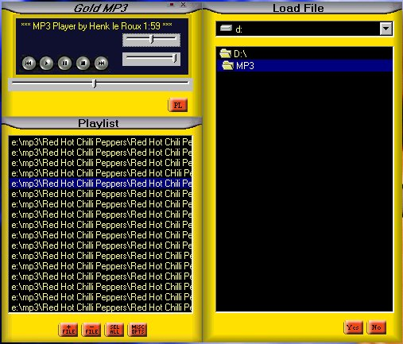



## GoldMP3

### Description

Using Windows Media Player to play MP3's
 
### More Info
 
This is a simple MP3 player that uses Windows Media Player. Features a playlist and some form functions. The layout is not to bad and it is worth taking a look at...

             |
---                |---
**Submitted On**   |2000-06-27 12:41:28
**By**             |[Koos Kombuis](https://github.com/Planet-Source-Code/PSCIndex/blob/master/ByAuthor/koos-kombuis.md)
**Level**          |Intermediate
**User Rating**    |3.5 (14 globes from 4 users)
**Compatibility**  |VB 3\.0, VB 4\.0 \(16\-bit\), VB 4\.0 \(32\-bit\), VB 5\.0, VB 6\.0, VB Script, ASP \(Active Server Pages\) 
**Category**       |[Sound/MP3](https://github.com/Planet-Source-Code/PSCIndex/blob/master/ByCategory/sound-mp3__1-45.md)
**World**          |[Visual Basic](https://github.com/Planet-Source-Code/PSCIndex/blob/master/ByWorld/visual-basic.md)
**Archive File**   |[CODE\_UPLOAD72986302000\.zip](https://github.com/Planet-Source-Code/koos-kombuis-goldmp3__1-9396/archive/master.zip)

